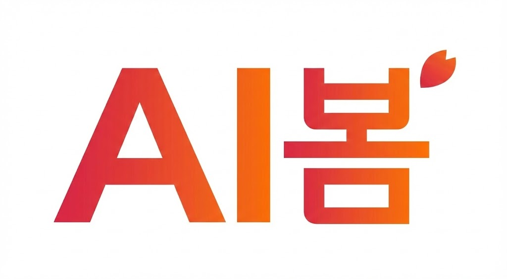

<p align="center">
  
</p>

<h1 align="center">AI봄 - AI Trend Tracker</h1>

<p align="center">
  <strong>9개 카테고리로 보는 AI 트렌드 큐레이션 서비스</strong><br />
  "AI를 본다 + 봄(Spring)" — 한국 AI 개발자를 위한 올인원 트렌드 대시보드
</p>

<p align="center">
  
  
  
  
  
  
  
  
</p>

<p align="center">
  <a href="https://ai-trend-tracker-beta.vercel.app">🌐 Live Demo</a> &bull;
  <a href="#빠른-시작">빠른 시작</a> &bull;
  <a href="#기술-스택">기술 스택</a> &bull;
  <a href="#api-엔드포인트">API 문서</a> &bull;
  <a href="#배포">배포</a>
</p>

---

## 목차

- [프로젝트 소개](#프로젝트-소개)
- [라이브 데모](#라이브-데모)
- [v3.1 주요 변경사항](#v31-주요-변경사항)
- [시스템 아키텍처](#시스템-아키텍처)
- [9개 AI 트렌드 카테고리](#9개-ai-트렌드-카테고리)
- [주요 기능](#주요-기능)
- [기술 스택](#기술-스택)
- [프로젝트 구조](#프로젝트-구조)
- [빠른 시작](#빠른-시작)
- [환경 변수 설정](#환경-변수-설정)
- [API 엔드포인트](#api-엔드포인트)
- [데이터 수집 파이프라인](#데이터-수집-파이프라인)
- [배포](#배포)
- [듀얼 AI 개발 전략](#듀얼-ai-개발-전략)
- [버전 히스토리](#버전-히스토리)
- [개발자](#개발자)
- [라이선스](#라이선스)

---

## 프로젝트 소개

**AI봄**은 AI 업계의 최신 트렌드를 9개 카테고리로 자동 수집하고, Google Gemini 2.0 Flash로 한글 요약하여 제공하는 **풀스택 웹 서비스**입니다.

카테고리별 최적 주기로 Hugging Face, YouTube, arXiv, GitHub, 뉴스 RSS, 컨퍼런스, AI 플랫폼, 채용 공고, AI 정책 등 다양한 소스에서 데이터를 자동 수집합니다.

### 핵심 가치

| 가치 | 설명 |
|------|------|
| **시간 절약** | 15개 사이트를 돌아다니지 않고, 한 화면에서 AI 트렌드 파악 |
| **한국어** | 모든 영어 콘텐츠를 Gemini AI가 자동 한글 요약 |
| **신뢰** | 실시간 데이터 + 출처 명시 + 소프트 아카이브 |
| **상용화 품질** | 글래스모피즘 UI, SVG 아이콘, 다크/라이트 테마 |
| **스마트 수집** | 카테고리별 최적 주기 (뉴스 1시간 ~ 플랫폼 매주) |

---

## 라이브 데모

| 서비스 | URL | 상태 |
|--------|-----|------|
| **프론트엔드 (Vercel)** | [ai-trend-tracker-beta.vercel.app](https://ai-trend-tracker-beta.vercel.app) | ✅ Production |
| **백엔드 API (Railway)** | [ai-trend-tracker-production.up.railway.app](https://ai-trend-tracker-production.up.railway.app/docs) | ✅ Production |

> 비밀번호: `test1234` (데모용) / 관리자: `admin1234`

---

## v3.1 주요 변경사항

> 2026-02-08 | v3.0 → v3.1 대시보드/백엔드 대규모 강화

### 대시보드

| 변경 | 상세 |
|------|------|
| **LivePulse 실시간 위젯** | 핫 토픽 + 수집 수치 + 최근 업데이트 3열 실시간 대시보드 |
| **워드 클라우드** | react-d3-cloud 기반 트렌딩 키워드 시각화 (외부 API 3종) |
| **앱 가이드** | 접기/펼치기 가능한 온보딩 가이드 섹션 |
| **Top 10 카드** | 카테고리별 스크롤 가능한 상위 10건 + 외부 링크 |
| **로그인 리디자인** | 회색 배경 + 깔끔한 SaaS 스타일 |

### 백엔드

| 변경 | 상세 |
|------|------|
| **외부 트렌딩 키워드** | HuggingFace + Hacker News + PapersWithCode 3종 API 수집 |
| **LivePulse API** | `/api/v1/dashboard/live-pulse` — 핫 아이템 + 통계 + 수집 로그 |
| **GitHub 다중쿼리** | 10개 토픽 검색 + mega-repo 제외 (tensorflow 등) |
| **YouTube 채널 교체** | 한국 14개 + 해외 15개 AI 전문 채널 (채널 ID 검증) |
| **뉴스 AI 필터링** | AI 키워드 필터 강화, 해외 뉴스 한글 요약 자동 생성 |
| **채용 직무 분류** | 10개 직무 카테고리 자동 분류 + 트렌딩 스킬 집계 |
| **컨퍼런스 날짜 수정** | datetime 파싱 버그 수정, 2025 이전 연도 필터링 |
| **수집량 증가** | HF 50개/회, Papers 100개/회, GitHub 50개/쿼리 등 |
| **API 요청 카운트** | Redis 기반 일별 API 호출 수 집계 미들웨어 |

### 프론트엔드

| 변경 | 상세 |
|------|------|
| **컨퍼런스 캘린더** | FullCalendar 월간 뷰 + 티어별 색상 + 이벤트 상세 모달 |
| **채용 탭 강화** | 10개 직무 카테고리 가로 스크롤 탭 + 트렌딩 스킬 TOP 10 |
| **검색 네비게이션** | 검색 결과 클릭 시 카테고리 페이지/외부 URL 이동 |
| **Sidebar 시계** | 실시간 KST 시간 표시 (사이드바 하단) |
| **불필요 UI 정리** | 북마크/알림 아이콘 제거, 카테고리 현황 → System 이동 |

### 신규 파일

| 파일 | 용도 |
|------|------|
| `app/services/trending_keyword_service.py` | 외부 3종 키워드 수집 서비스 |
| `web-next/src/components/dashboard/LivePulse.tsx` | 실시간 대시보드 3열 위젯 |
| `web-next/src/components/conferences/CalendarView.tsx` | FullCalendar 캘린더 뷰 |

---

## 시스템 아키텍처

```
                      +-------------------+
                      |   사용자 (브라우저)  |
                      +--------+----------+
                               |
                      +--------v----------+
                      |   Next.js 14       |
                      |   App Router       |
                      |   + SWR + SVG Icons|
                      +--------+----------+
                               |
                      +--------v----------+
                      |   FastAPI Server   |
                      |   (비동기 Python)   |
                      +--+------+------+--+
                         |      |      |
              +----------+  +---+---+  +----------+
              |             |       |             |
              v             v       v             v
     +----------------+ +------+ +----------+ +----------+
     | PostgreSQL 15  | | Redis| | APScheduler| | Gemini  |
     | + Alembic      | | 7    | | (카테고리별 | | 2.0     |
     | + 9 테이블     | |      | |  최적 주기) | | Flash   |
     +----------------+ +------+ +----------+ +----------+
                                      |
                         +------------+------------+
                         |            |            |
                         v            v            v
                    [HF API]   [YouTube]    [arXiv]
                    [GitHub]   [RSS Feeds]  [WikiCFP]
                    [RemoteOK] [구조화 데이터]
```

---

## 9개 AI 트렌드 카테고리

| # | 카테고리 | 데이터 소스 | 수집 주기 | 탭 필터 |
|---|---------|-----------|----------|---------|
| 1 | **Hugging Face** | Hugging Face Hub API | 매 6시간 | 태스크별 |
| 2 | **YouTube** | YouTube Data API v3 | 매 4시간 | 국내/해외 |
| 3 | **AI 논문** | arXiv API | 매 12시간 | 주제별 (NLP, CV, ML...) |
| 4 | **AI 뉴스** | RSS Feeds (전자신문, AI타임스...) | 매 1시간 | 전체/국내/해외 |
| 5 | **GitHub** | GitHub Search API (fan-out) | 매 6시간 | 카테고리별 |
| 6 | **컨퍼런스** | WikiCFP, AI Deadlines | 매일 | 티어별 (A*/A/B) |
| 7 | **AI 플랫폼** | 구조화 데이터 | 매주 월요일 | 전체 |
| 8 | **AI 채용** | RemoteOK API, RSS | 매 6시간 | 직무 10종 (백엔드/AI SW/LLM/비전...) |
| 9 | **AI 정책** | 정부 RSS, AI News | 매일 | 국가별 (한국/미국/EU/중국) |

---

## 주요 기능

### 1. 스마트 스케줄러
카테고리별 최적 수집 주기로 API 호출을 최소화하면서 데이터 신선도를 유지합니다.

```
뉴스: 매 1시간 | YouTube: 매 4시간 | HF/GitHub/채용: 매 6시간
논문: 매 12시간 | 컨퍼런스/정책: 매일 | 플랫폼: 매주 월요일
아카이브: 매일 03:30 (30일 이상 오래된 데이터 소프트 삭제)
```

### 2. AI 한글 요약 (Gemini 2.0 Flash)
- 카테고리별 맞춤 프롬프트로 한글 요약 생성
- summary, keywords, key_features, use_cases 등 구조화 출력
- JSON 파싱 공통화로 안정성 향상

### 3. 전역 검색
- `/api/v1/search` — PostgreSQL FTS + ILIKE fallback
- 모든 카테고리 통합 검색 + 페이지네이션
- TopBar 검색 UI 연동

### 4. 소프트 아카이브
- 30일 이상 오래된 데이터를 자동 아카이브 (삭제 아님)
- `is_archived`, `archived_at` 필드로 복원 가능
- API에서 `include_archived=true` 옵션으로 아카이브 데이터 조회

### 5. 에러 알림 (웹훅)
- 스케줄러 작업 실패 시 Slack/Discord 웹훅 자동 알림
- `ERROR_WEBHOOK_SLACK`, `ERROR_WEBHOOK_DISCORD` 환경변수로 설정

### 6. SVG 아이콘 시스템
- 11개 카테고리 전용 SVG 아이콘 (`CategoryIcons.tsx`)
- `iconKey` 기반 렌더링 (이모지 완전 제거)
- 다크/라이트 테마 대응

### 7. 다크/라이트 테마
- `aibom-theme` localStorage 키로 저장
- 글래스모피즘 디자인 (backdrop-blur + bg-white/5)

---

## 기술 스택

### 프론트엔드

| 기술 | 용도 |
|------|------|
| Next.js 14 (App Router) | SSR/CSR 프레임워크 |
| TypeScript 5 | 정적 타입 |
| Tailwind CSS 3.4 | 유틸리티 CSS |
| SWR | 데이터 패칭 (stale-while-revalidate) |
| Framer Motion | 애니메이션 |
| Lucide React | 아이콘 |
| next/image | 이미지 최적화 |
| react-d3-cloud | 워드 클라우드 시각화 |
| FullCalendar | 컨퍼런스 캘린더 뷰 |

### 백엔드

| 기술 | 용도 |
|------|------|
| FastAPI 0.128 | 비동기 웹 프레임워크 |
| SQLAlchemy 2.0 (asyncpg) | 비동기 ORM |
| Alembic | DB 마이그레이션 |
| PostgreSQL 15 | 데이터베이스 |
| Redis 7 | 캐싱 |
| APScheduler 3.10 | 크론 스케줄링 |
| google-generativeai | Gemini 2.0 Flash API |
| httpx | 비동기 HTTP 클라이언트 |
| feedparser | RSS/Atom 파서 |

### 인프라

| 서비스 | 용도 |
|--------|------|
| Docker Compose | 로컬 개발 (API + PostgreSQL + Redis) |
| Railway | 백엔드 클라우드 호스팅 |
| Vercel | 프론트엔드 CDN + Edge |

---

## 프로젝트 구조

```
fastapi-starter/
├── app/                              # 백엔드 (FastAPI)
│   ├── main.py                       # 앱 진입점
│   ├── config.py                     # 환경 변수 (gemini_model, webhook 등)
│   ├── database.py                   # PostgreSQL 비동기 연결
│   ├── cache.py                      # Redis 캐싱 유틸
│   ├── auth.py                       # API Key + HTTP Basic 인증
│   ├── db_compat.py                  # DB 컬럼 호환 유틸 (v3.0 신규)
│   │
│   ├── api/v1/                       # API 라우터
│   │   ├── dashboard.py              # 대시보드 통계
│   │   ├── search.py                 # 전역 검색 (v3.0 신규)
│   │   ├── system.py                 # 시스템 상태 + 수집 로그
│   │   ├── huggingface.py            # HF 모델
│   │   ├── youtube.py                # YouTube 영상
│   │   ├── papers.py                 # AI 논문
│   │   ├── news.py                   # AI 뉴스
│   │   ├── github.py                 # GitHub 프로젝트
│   │   ├── conferences.py            # 컨퍼런스
│   │   ├── tools.py                  # AI 플랫폼
│   │   ├── jobs.py                   # AI 채용
│   │   └── policies.py               # AI 정책
│   │
│   ├── models/                       # SQLAlchemy 모델 (9개 + 채널)
│   │   └── *.py                      # is_archived, archived_at 포함
│   │
│   ├── schemas/                      # Pydantic 스키마
│   │   └── *.py                      # 페이지네이션 + 아카이브 응답
│   │
│   └── services/                     # 비즈니스 로직
│       ├── scheduler.py              # 카테고리별 최적 주기 스케줄러
│       ├── ai_summary_service.py     # Gemini 2.0 Flash 요약
│       ├── notification_service.py   # Slack/Discord 웹훅 (v3.0 신규)
│       └── *_service.py              # 9개 수집 서비스
│
├── web-next/                         # 프론트엔드 (Next.js 14)
│   ├── src/
│   │   ├── app/                      # App Router 페이지
│   │   │   ├── page.tsx              # 대시보드 (실데이터)
│   │   │   ├── login/page.tsx        # 프리미엄 로그인
│   │   │   └── */page.tsx            # 9개 카테고리 + 시스템
│   │   │
│   │   ├── components/
│   │   │   ├── icons/                # SVG 아이콘 (v3.0 신규)
│   │   │   │   ├── CategoryIcons.tsx # 11개 카테고리 SVG
│   │   │   │   └── CategoryIcon.tsx  # iconKey 기반 렌더러
│   │   │   ├── dashboard/            # 대시보드 위젯
│   │   │   │   ├── LivePulse.tsx     # 실시간 3열 위젯 (v3.1)
│   │   │   │   └── TrendingKeywords.tsx # 워드 클라우드 (v3.1)
│   │   │   ├── conferences/          # 컨퍼런스 컴포넌트
│   │   │   │   └── CalendarView.tsx  # FullCalendar 뷰 (v3.1)
│   │   │   ├── layout/               # Sidebar, TopBar, MobileNav, LoginScreen
│   │   │   └── shared/               # 공통 컴포넌트
│   │   │
│   │   └── lib/                      # 유틸리티
│   │       ├── types.ts              # 타입 정의
│   │       ├── constants.ts          # 카테고리 상수 (iconKey 체계)
│   │       ├── fetcher.ts            # SWR 공통 fetcher (v3.0 신규)
│   │       ├── user-preferences.ts   # 북마크/최근본 (v3.0 신규)
│   │       ├── auth-context.tsx      # 인증 컨텍스트
│   │       └── theme-context.tsx     # 테마 컨텍스트
│   │
│   └── public/
│       ├── AI봄.jpg                  # 로고
│       └── manifest.json             # PWA 매니페스트
│
├── alembic/                          # DB 마이그레이션
│   └── versions/
│       ├── c2d3..._add_hf_taskko_and_paper_metadata.py
│       └── d3e4..._add_archive_fields_and_youtube_language.py
│
├── docs/                             # 딥 리서치 프롬프트
├── docker-compose.yml                # Docker (API + PG + Redis)
├── Dockerfile                        # FastAPI 이미지
└── requirements.txt                  # Python 의존성
```

---

## 빠른 시작

### Docker Compose (권장)

```bash
# 1. 클론
git clone https://github.com/DONGJUSEO/ai-trend-tracker.git
cd ai-trend-tracker

# 2. 환경 변수
cp .env.example .env
# .env에 API 키 입력 (GEMINI_API_KEY, YOUTUBE_API_KEY 등)

# 3. 백엔드 실행 (API + PostgreSQL + Redis + 자동 마이그레이션)
docker compose up -d

# 4. 프론트엔드 실행
cd web-next
npm install
npm run dev
```

| 서비스 | URL |
|--------|-----|
| 프론트엔드 | http://localhost:3000 |
| 백엔드 API | http://localhost:8000 |
| Swagger 문서 | http://localhost:8000/docs |
| Health Check | http://localhost:8000/health |

---

## 환경 변수 설정

### 백엔드 (.env)

| 변수명 | 필수 | 기본값 | 설명 |
|--------|------|--------|------|
| `DATABASE_URL` | 필수 | - | PostgreSQL 연결 문자열 |
| `REDIS_URL` | 필수 | - | Redis 연결 문자열 |
| `GEMINI_API_KEY` | 선택 | `""` | Gemini AI API 키 |
| `GEMINI_MODEL` | 선택 | `gemini-2.0-flash` | Gemini 모델 지정 |
| `YOUTUBE_API_KEY` | 선택 | `""` | YouTube Data API v3 키 |
| `GITHUB_TOKEN` | 선택 | `""` | GitHub PAT |
| `APP_PASSWORD` | 선택 | `test1234` | 사이트 접근 비밀번호 |
| `ADMIN_PASSWORD` | 선택 | `admin1234` | 관리자 비밀번호 |
| `JWT_SECRET_KEY` | 선택 | (자동 생성) | JWT 서명 키 |
| `ERROR_WEBHOOK_SLACK` | 선택 | `""` | Slack 에러 알림 웹훅 URL |
| `ERROR_WEBHOOK_DISCORD` | 선택 | `""` | Discord 에러 알림 웹훅 URL |

### 프론트엔드 (.env.development)

```env
NEXT_PUBLIC_API_URL=http://localhost:8000
NEXT_PUBLIC_API_KEY=test1234
```

---

## API 엔드포인트

모든 API는 `/api/v1/` 프리픽스, `X-API-Key` 헤더 인증 필요.

### 카테고리 API

| 메서드 | 엔드포인트 | 응답 키 | 페이지네이션 |
|--------|-----------|---------|-------------|
| `GET` | `/api/v1/huggingface/` | `items` | `page`, `page_size` |
| `GET` | `/api/v1/youtube/videos` | `videos` | `page`, `page_size` |
| `GET` | `/api/v1/papers/` | `papers` | `page`, `page_size` |
| `GET` | `/api/v1/news/news` | `news` | `page`, `page_size` |
| `GET` | `/api/v1/github/projects` | `items` | `page`, `page_size` |
| `GET` | `/api/v1/conferences/` | `items` | `page`, `page_size` |
| `GET` | `/api/v1/tools/` | `items` | `page`, `page_size` |
| `GET` | `/api/v1/jobs/` | `items` | `page`, `page_size` |
| `GET` | `/api/v1/policies/` | `items` | `page`, `page_size` |

### 신규 API (v3.0 ~ v3.1)

| 메서드 | 엔드포인트 | 설명 |
|--------|-----------|------|
| `GET` | `/api/v1/search?q=AI&page_size=10` | 전역 검색 (카테고리 통합) |
| `GET` | `/api/v1/dashboard/live-pulse` | 실시간 핫 토픽 + 수집 통계 + 수집 로그 |
| `GET` | `/api/v1/dashboard/external-trending-keywords?limit=50` | 외부 3종 API 트렌딩 키워드 |
| `GET` | `/api/v1/system/status` | 시스템 상태 + API 요청 카운트 + DB/Redis 정보 |

### 공통 쿼리 파라미터 (v3.0)

| 파라미터 | 타입 | 설명 |
|---------|------|------|
| `page` | int | 페이지 번호 (1부터) |
| `page_size` | int | 페이지 크기 (기본 20) |
| `include_archived` | bool | 아카이브 데이터 포함 여부 |

---

## 데이터 수집 파이프라인

```
APScheduler (카테고리별 최적 주기)
    |
    +---> [뉴스] 매 1시간         → NewsService → RSS Feeds
    +---> [YouTube] 매 4시간      → YouTubeService → YouTube API
    +---> [HF/GitHub/채용] 매 6시간 → 각 Service → 각 API
    +---> [논문] 매 12시간         → ArxivService → arXiv API
    +---> [컨퍼런스/정책] 매일     → 각 Service → WikiCFP/RSS
    +---> [플랫폼] 매주 월요일     → AIToolService → 구조화 데이터
    +---> [아카이브] 매일 03:30    → 30일+ 데이터 소프트 삭제
    |
    v
각 수집 후: AISummaryService (Gemini 2.0 Flash)
    +---> 요약 없는 항목 → 한글 요약 생성 → DB 업데이트
    +---> 수집 실패 시 → NotificationService → Slack/Discord 웹훅
    +---> 수집 완료 시 → Redis 캐시 무효화
```

---

## 배포

### 프론트엔드: Vercel

```bash
# Vercel에 연결 (GitHub 연동으로 main 브랜치 자동 배포)
# vercel.json (루트):
# { "version": 2, "rootDirectory": "web-next" }

# 환경 변수 (Vercel Dashboard에서 설정):
# NEXT_PUBLIC_API_URL = https://ai-trend-tracker-production.up.railway.app
# NEXT_PUBLIC_API_KEY = <your-api-key>
```

### 백엔드: Railway

```bash
# Railway에 연결 (GitHub 연동으로 main 브랜치 자동 배포)
# Dockerfile 기반 빌드 (Python 3.9-slim)
# start.sh: Alembic 마이그레이션 + Uvicorn 서버

# 필수 환경 변수 (Railway Dashboard에서 설정):
# DATABASE_URL = postgresql+asyncpg://<user>:<pass>@<host>:5432/ai_trends
# REDIS_URL = redis://<host>:6379
# GEMINI_API_KEY = <gemini-key>
# YOUTUBE_API_KEY = <youtube-key>
# GITHUB_TOKEN = <github-pat>
```

### 배포 URL

| 서비스 | URL |
|--------|-----|
| 프론트엔드 | https://ai-trend-tracker-beta.vercel.app |
| 백엔드 API | https://ai-trend-tracker-production.up.railway.app |
| Swagger 문서 | https://ai-trend-tracker-production.up.railway.app/docs |
| Health Check | https://ai-trend-tracker-production.up.railway.app/health |

### 배포 프로세스

```
git push origin main
    │
    ├──→ Vercel: 자동 빌드 (Next.js) → CDN 배포 (~1분)
    │
    └──→ Railway: 자동 빌드 (Dockerfile) → Alembic 마이그레이션 → 서버 시작 (~3분)
```

---

## 듀얼 AI 개발 전략

AI봄은 **ChatGPT 5.3 Codex + Claude Code Opus 4.6** 듀얼 AI 바이브 코딩으로 개발됩니다.

| 역할 | ChatGPT 5.3 Codex (건축가) | Claude Code Opus 4.6 (외과의사) |
|------|---------------------------|-------------------------------|
| 강점 | 완전 자율 실행, 딥 리서치 | 정밀 수정, 실시간 디버깅 |
| 최적 작업 | 신규 파일 생성, 대규모 반복 | 버그 수정, 빌드 테스트, 통합 |
| 원칙 | **한 파일에 한 AI** | **Claude Code가 최종 관문** |

### 하루 워크플로우

```
[아침] Claude Code 계획 수립 → [오전] Codex 자율 실행 → [오후] Claude Code 검증/통합 → [저녁] 커밋
```

---

## 버전 히스토리

### v3.1.1 (2026-02-08) — 데이터 품질 P0/P1 수정

- **컨퍼런스 날짜 버그**: 1970년 epoch 날짜 → force-delete 후 2026 날짜 재삽입
- **AI 논문 한글 요약**: Gemini `summarize_paper()` 자동 호출 (신규/기존 모두)
- **HuggingFace 한글 설명**: Gemini `summarize_huggingface_model()` 자동 호출
- **뉴스 AI 필터링 강화**: 광범위 키워드 제거 (네이버/삼성 → 네이버 ai/삼성 ai), 짧은 키워드 regex word boundary 매칭
- **정책 HTML 태그 제거**: RSS 설명/제목에서 `<p>`, `<a>` 등 HTML 엔티티 자동 클리닝
- **채용 직무 오분류 해결**: 2글자 키워드(ai, ml) 제거, 다중 단어 키워드 기반 정밀 분류
- **GitHub 비AI 레포 제외**: EXCLUDE_REPOS 8개 → 28개 확장 (developer-roadmap, yt-dlp 등)
- **YouTube 국내 탭 수정**: 프론트엔드 채널명 불일치 해결 (노마드코더 등)
- **라이트 모드 CSS 보완**: Codex 생성 5개 컴포넌트 라이트 모드 + FullCalendar CSS 오버라이드

### v3.1.0 (2026-02-08) — 대시보드/백엔드 강화

- LivePulse 실시간 3열 대시보드 위젯 (핫 토픽 / 수집 통계 / 수집 로그)
- react-d3-cloud 워드 클라우드 (HuggingFace + HN + PapersWithCode 3종 외부 API)
- FullCalendar 컨퍼런스 캘린더 뷰 (티어별 색상, 이벤트 모달)
- 채용 10개 직무 카테고리 분류 + 트렌딩 스킬 TOP 10
- YouTube 채널 전면 교체 (한국 14 + 해외 15 AI 전문 채널)
- GitHub 다중쿼리 + mega-repo 제외
- 뉴스 AI 키워드 필터링 강화 + 수집량 증가
- 로그인 페이지 회색 배경 깔끔한 SaaS 스타일 리디자인
- 대시보드 앱 가이드 + Top 10 스크롤 카드 + 외부 링크

### v3.0.0 (2026-02-08) — Codex 통합 대규모 개선

- AI 요약 서비스 4종 메서드 추가, Gemini 2.0 Flash 통일
- 전역 검색 API (`/api/v1/search`) 신규
- 페이지네이션 통일 (page/page_size + skip/limit)
- 소프트 아카이브 (9개 테이블, 매일 자동)
- SVG 아이콘 시스템 (이모지 제거)
- 대시보드 실데이터 전환, 전 카테고리 탭 필터
- SWR 전역 적용, next/image 최적화

### v2.0.0 (2026-02-07) — Next.js 전면 재구축

- SvelteKit → Next.js 14 App Router 전환
- 글래스모피즘 디자인 + 다크/라이트 테마
- Redis 캐싱 + 대시보드 API
- 사이트 인증 + 관리자 JWT 인증
- 9개 카테고리 최적화

### v0.3.2 (2026-02-02) — 초기 버전

- 11개 카테고리 SvelteKit + FastAPI
- PostgreSQL + Redis + APScheduler
- Gemini AI 한글 요약
- Railway + Vercel 배포

---

## 개발자

<table>
  <tr>
    <td align="center">
      <a href="https://github.com/DONGJUSEO">
        <strong>서동주 (@DONGJUSEO)</strong>
      </a>
      <br />
      풀스택 개발 / 프로젝트 기획
    </td>
    <td align="center">
      <strong>Claude Opus 4.6</strong>
      <br />
      AI 개발 어시스턴트 (Anthropic)
    </td>
    <td align="center">
      <strong>ChatGPT 5.3 Codex</strong>
      <br />
      AI 코드 생성 (OpenAI)
    </td>
  </tr>
</table>

---

## 라이선스

이 프로젝트는 [MIT License](LICENSE)로 배포됩니다.

```
MIT License
Copyright (c) 2026 서동주 (DONGJUSEO)
```

---

<p align="center">
  <strong>AI봄 - AI Trend Tracker</strong> | v3.1.1 | 2026-02-08
</p>

<p align="center">
  Made with FastAPI + Next.js 14 + Gemini 2.0 Flash + Dual AI Vibe Coding
</p>
